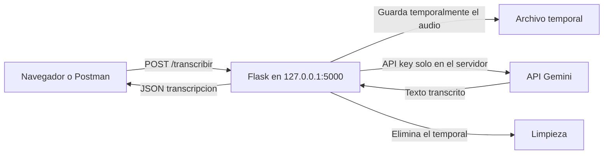

# Comparativa y arquitectura

## Web Speech API frente a Gemini

| Caracteristica | Web Speech API | Gemini |
| --- | --- | --- |
| Tiempo de respuesta | Tiempo real | Procesamiento por lotes |
| Precision | Media; puede fallar con ruido, acentos o nombres propios | Alta; entiende mejor el contexto |
| Lugar de ejecucion | Navegador compatible | Backend conectado a la API de Gemini |
| Conexion | Depende del navegador y su implementacion | Requiere conexion a Internet desde el servidor |
| Archivos de audio | No esta pensada para audios largos guardados | Acepta archivos como `.wav`, `.mp3`, `.m4a` y `.webm` |
| API key | No se expone en el frontend | Debe permanecer en el backend, dentro de `.env` |
| Ventaja principal | Permite ver la transcripcion mientras hablamos | Produce transcripciones mas precisas a partir del audio completo |
| Inconveniente principal | Compatibilidad y precision variables entre navegadores | Tiene latencia, consume cuota y necesita un backend |

### Conclusion

Web Speech API es la mejor opcion para subtitulos o dictado inmediato en el navegador. Gemini es mas apropiado para procesar grabaciones completas, conservar una transcripcion y obtener mayor precision. En este prototipo se usa Gemini para la transcripcion final y el navegador para capturar el audio.

## Endpoint ASIX

El backend Flask implementa:

```text
POST /transcribir
Content-Type: multipart/form-data
Campo: audio
```

Ejemplo con PowerShell:

```powershell
curl.exe -X POST http://127.0.0.1:5000/transcribir -F "audio=@audio1.m4a"
```

Respuesta correcta:

```json
{
  "transcripcion": "Audio dos"
}
```

El endpoint tambien devuelve errores JSON si falta el archivo (`400`), si el formato no esta permitido (`415`) o si Gemini no puede procesarlo (`502`).

## Arquitectura de red



### Flujo

1. El navegador o Postman envia el audio como `multipart/form-data`.
2. Flask valida la extension y guarda el archivo temporalmente.
3. El backend envia el audio a Gemini usando `GEMINI_API_KEY` desde `.env`.
4. Gemini devuelve el texto transcrito.
5. Flask devuelve el texto en JSON y elimina el archivo temporal.

La API key no se incluye en `index.html` ni se envia al navegador.